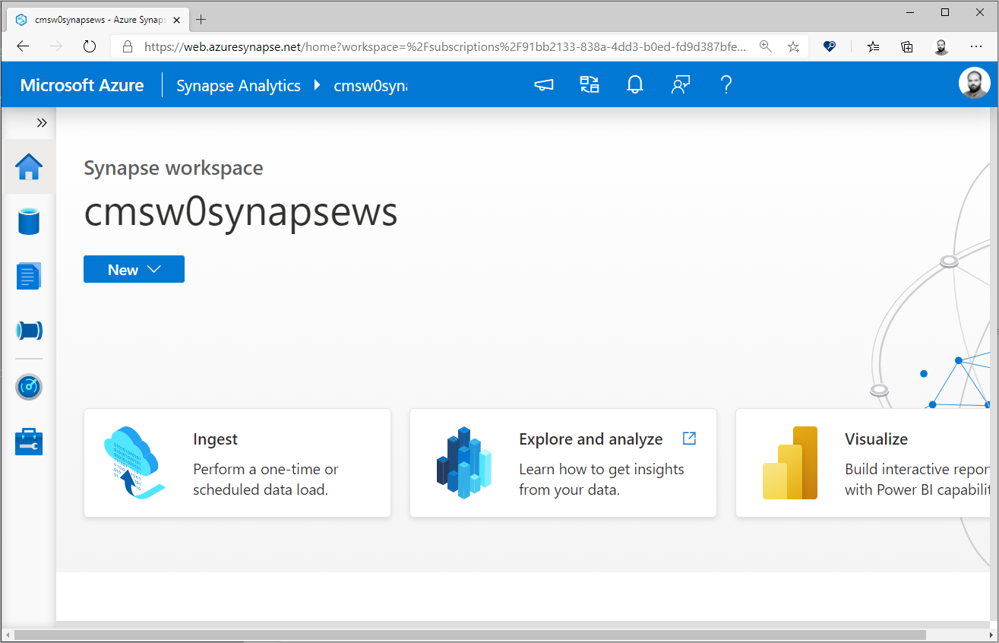
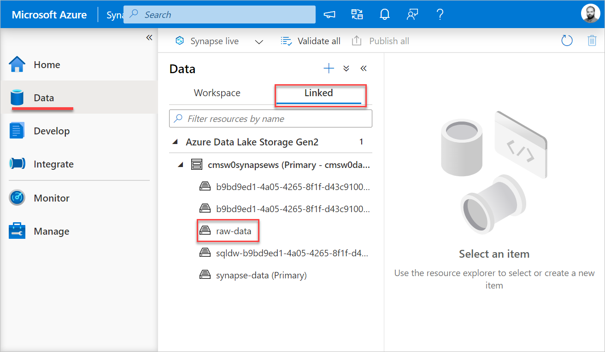
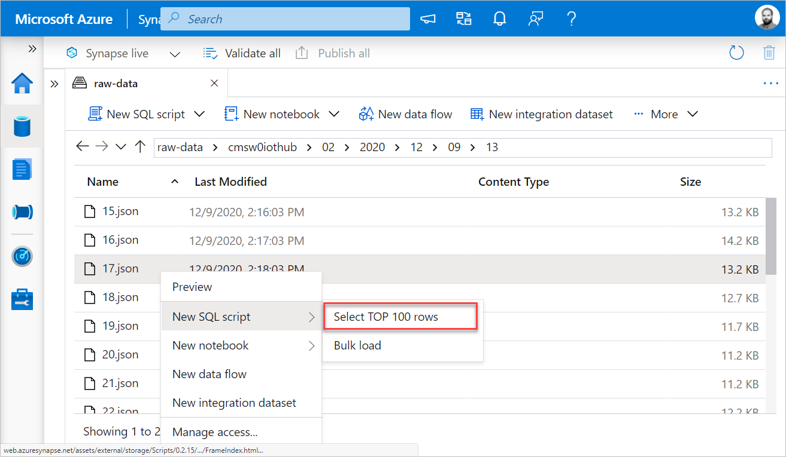
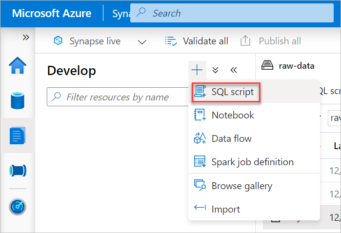
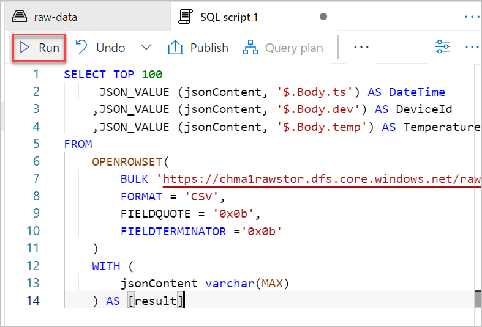
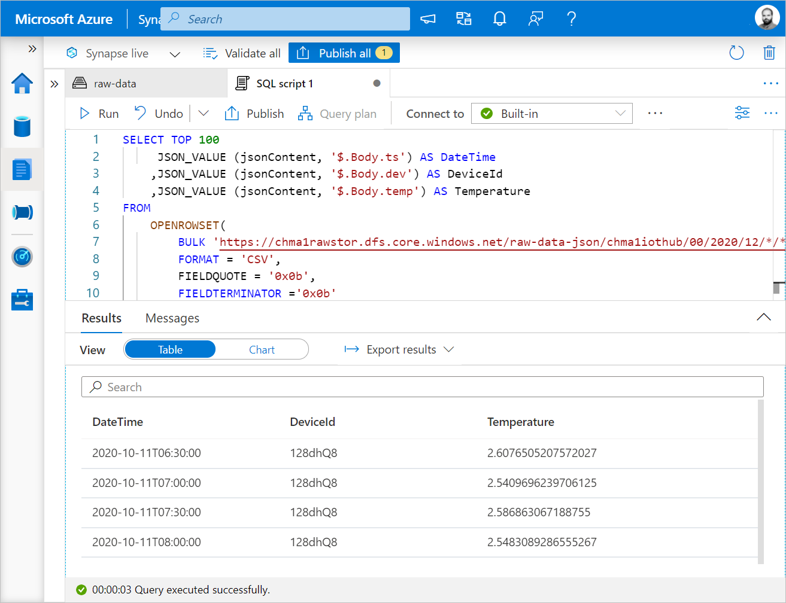

# Analyse raw data stored in flat files using SQL

> **Objective** Query raw iot devices data stored in Data Lake with Synapse Serverless SQL pool.

This step is done within [Azure Synapse Web UI](https://web.azuresynapse.net/). Open this page and select the workspace you've created at the previous step.



## Explore linked data

Synapse Web UI allows you to explore the structure and files of your data lake.

To do it: 
1. Click on **Data** Tab on the left
1. On the Data Pane, click the **Linked** Tab
1. You should see a linked data lake. Click on **raw-data** container



You can now explore the contents of your data lake. The IoT Hub created at the previous step should have created an entire folder structure. Navigate into it until you see some JSON files.

If you right-click on one of the files, you can now see the different actions you can take, including executing a SQL query over it.



<details>
<summary>
Common errors
</summary>

**File cannot be opened because it does not exist or it is used by another process**

There is a small bug in the way the workshop is created by the automated script. Terminate the Azure Container instance within your resource group, wait about 2 minutes, and try again. 

If you're doing this, you'll need to launch the container again for the next steps of this workshop.

<hr/>
</details>

## Query raw data in SQL

> If you're doing the workshop on December 9-10, 2020 with us live, please use the following queries as is: we provide a storage account with almost 1M data points. 
> If you're doing this workshop later, please update the URLs of the data lake in the scripts below by your own.


### Parse the contents of the JSON files

We'll now use SQL Language to parse and query all these files stored into our datalake: 

1. On the left menu, select the **Develop** tab
1. Click on the Plus (+) sign, and select **SQL Script**




A new code editor will open. You can now copy the following code into the editor and click on **Run** in the toolbar.

```sql
SELECT TOP 100
     JSON_VALUE (jsonContent, '$.Body.ts') AS DateTime
    ,JSON_VALUE (jsonContent, '$.Body.dev') AS DeviceId
    ,JSON_VALUE (jsonContent, '$.Body.temp') AS Temperature
FROM
    OPENROWSET(
        BULK 'https://chma1rawstor.dfs.core.windows.net/raw-data-json/chma1iothub/00/2020/12/*/*/*',
        FORMAT = 'CSV',
        FIELDQUOTE = '0x0b',
        FIELDTERMINATOR ='0x0b'
    )
    WITH (
        jsonContent varchar(MAX)
    ) AS [result]
```




The first execution may take few seconds (about 20). You'll then be able to see the result directly in the editor. Click on **Chart** to see your data! 



You can now play with few queries :)

### How many records am-I querying?

```sql
SELECT 
    COUNT(jsonContent) 
FROM
    OPENROWSET(
        BULK 'https://chma1rawstor.dfs.core.windows.net/raw-data-json/chma1iothub/00/2020/12/*/*/*',
        FORMAT = 'CSV',
        FIELDQUOTE = '0x0b',
        FIELDTERMINATOR ='0x0b'
    )
    WITH (
        jsonContent varchar(MAX)
    ) AS [result]
```

### What's the average temperature per device?
```sql
SELECT
    JSON_VALUE (jsonContent, '$.Body.dev') AS DeviceId
    ,AVG(CAST(JSON_VALUE (jsonContent, '$.Body.temp') AS FLOAT)) AS Temperature
FROM
    OPENROWSET(
        BULK 'https://chma1rawstor.dfs.core.windows.net/raw-data-json/chma1iothub/00/2020/12/*/*/*',
        FORMAT = 'CSV',
        FIELDQUOTE = '0x0b',
        FIELDTERMINATOR ='0x0b'
    )
    WITH (
        jsonContent varchar(MAX)
    ) AS [result]
GROUP BY JSON_VALUE (jsonContent, '$.Body.dev')
ORDER BY Temperature DESC
```

### What's the number of messages per device?
```sql
    SELECT 
       JSON_VALUE (jsonContent, '$.Body.dev') as DeviceId,
       COUNT(jsonContent) as NumberOfMessages
    FROM
        OPENROWSET(
            BULK 'https://chma1rawstor.dfs.core.windows.net/raw-data-json/chma1iothub/00/2020/12/*/*/*',
            FORMAT = 'CSV',
            FIELDQUOTE = '0x0b',
            FIELDTERMINATOR ='0x0b'
        )
        WITH (
            jsonContent varchar(MAX)
        ) AS [result]
GROUP BY JSON_VALUE (jsonContent, '$.Body.dev')
ORDER BY NumberOfMessages ASC

```

## Want to learn more?

- [⌨️ Learn - Import data into Azure Synapse](https://docs.microsoft.com/learn/modules/import-data-into-asdw-with-polybase/?wt.mc_id=startup-11038-chmaneu)
- [📚 Docs - External tables](https://docs.microsoft.com/azure/synapse-analytics/sql/develop-tables-external-tables?tabs=sql-pool?wt.mc_id=startup-11038-chmaneu)
- [📚 Docs - OPENROWSET](https://docs.microsoft.com/azure/synapse-analytics/sql/develop-openrowset?wt.mc_id=startup-11038-chmaneu)
- [📚 Docs - Query Specific files](https://docs.microsoft.com/azure/synapse-analytics/sql/query-specific-files?wt.mc_id=startup-11038-chmaneu)

<hr />

## *[Next: Create Synapse DB](../2-create-synapse-db/index.md)*
