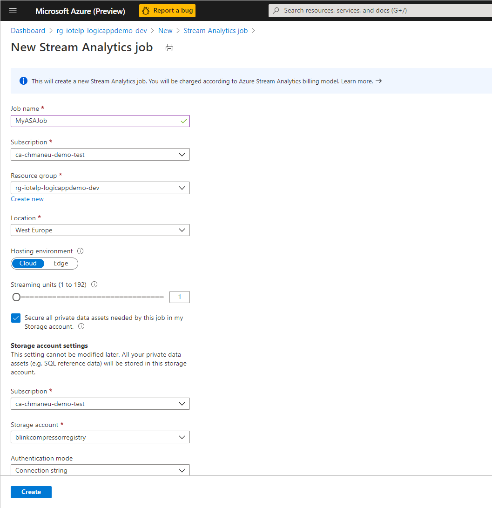

# Ingest IoT Data into Azure Synapse

> **Objective**: Create an Azure Stream Analytics Job that will send IoT Data into Azure Synapse Tables created at the step before.


## Create an Azure Stream Analytics Job

1. Sign in to the Azure portal.

1. Select **Create a resource** in the upper left-hand corner of the Azure portal.  

1. Select **Analytics** > **Stream Analytics job** from the results list.  

1. Fill out the Stream Analytics job page with the following information:

   |**Setting**  |**Suggested value**  |**Description**  |
   |---------|---------|---------|
   |Job name   |  MyASAJob   |   Enter a name to identify your Stream Analytics job. Stream Analytics job name can contain alphanumeric characters, hyphens, and underscores only and it must be between 3 and 63 characters long. |
   |Subscription  | \<Your subscription\> |  Select the Azure subscription that you want to use for this job. |
   |Resource group   |   The name of the resource group you've choose  |   Select the same resource group as your IoT Hub. |
   |Location  |  West Europe | Select geographic location where you can host your Stream Analytics job. Use the location that's closest to your users for better performance and to reduce the data transfer cost. |
   |Streaming units  | 1  |   Streaming units represent the computing resources that are required to execute a job. By default, this value is set to 1. To learn about scaling streaming units, refer to [understanding and adjusting streaming units](stream-analytics-streaming-unit-consumption.md) article.   |
   |Hosting environment  |  Cloud  |   Stream Analytics jobs can be deployed to cloud or edge. Cloud allows you to deploy to Azure Cloud, and Edge allows you to deploy to an IoT Edge device. |
   | Secure all private data assets needed by this job in my Storage account. | Check the box |  Select your Data Lake as a Storage account, and **Connection String** authentication mode. |


   

1. Check the **Pin to dashboard** box to place your job on your dashboard and then select **Create**.  

1. You should see a *Deployment in progress...* notification displayed in the top right of your browser window. 

## Add an Input and a output

### Configure job input

1. Navigate to your Stream Analytics job.  

2. Select **Inputs** > **Add Stream input** > **IoT Hub**.  

3. Fill out the **IoT Hub** page with the following values:

   |**Setting**  |**Suggested value**  |**Description**  |
   |---------|---------|---------|
   |Input alias  |  IoTHubInput   |  Enter a name to identify the job’s input.   |
   |Subscription   |  \<Your subscription\> |  Select the Azure subscription that has the storage account you created. The storage account can be in the same or in a different subscription. This example assumes that you have created storage account in the same subscription. |
   |IoT Hub  |  Select the IoT Hub created previously |  Enter the name of the IoT Hub you created in the previous section. |

4. Leave other options to default values and select **Save** to save the settings.  

### Configure job output

1. Navigate to the Stream Analytics job that you created earlier.  

2. Select **Outputs** > **Add** > **Azure Synapse Analytics**.  

3. Fill out the **Azure Synapse Analytics** page with the following values:

   |**Setting**  |**Suggested value**  |**Description**  |
   |---------|---------|---------|
   | Output Alias | SynapseMeasurementTable | |
   | Database | [RESOURCEPREFIX]pool | |
   | Table | Measurement | |
   | Username | demo | |  
   | Password | Password123! | |  

4. Leave other options to default values and select **Save** to save the settings.  

## Write the Transformation Script

1. Go to the **Query** tab, and paste the following query in the editor.
    ```sql
    SELECT
        dev as DeviceId,
        ts  as TimeStamp,
        temp as Temperature
    INTO
        [SynapseMeasurementTable]
    FROM
        [IoTHubInput]
    ```
1. Click on **Save query** in the toolbar
 
## Launch the job execution

1. Click on the **Overview** tab
1. Click on **Start** in the toolbar

The job will take few minutes to start. Take a 10 break, and see you at the last step!


## Additional infos

- [Docs - Create a Stream Analytics job](https://docs.microsoft.com/en-us/azure/stream-analytics/stream-analytics-quick-create-portal)
- [⌨️ Learn - Work with data streams](https://docs.microsoft.com/en-us/learn/modules/introduction-to-data-streaming/)
- [⌨️ Learn - Transform data with Stream Analytics](https://docs.microsoft.com/en-us/learn/modules/transform-data-with-azure-stream-analytics/)
- [📚 Docs - Create a Synapse workspace](https://docs.microsoft.com/en-us/azure/synapse-analytics/get-started-create-workspace)


## *[Next: Analyse IoT Data](../4-analyse-data/index.md)*